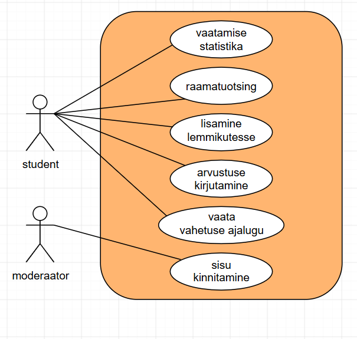
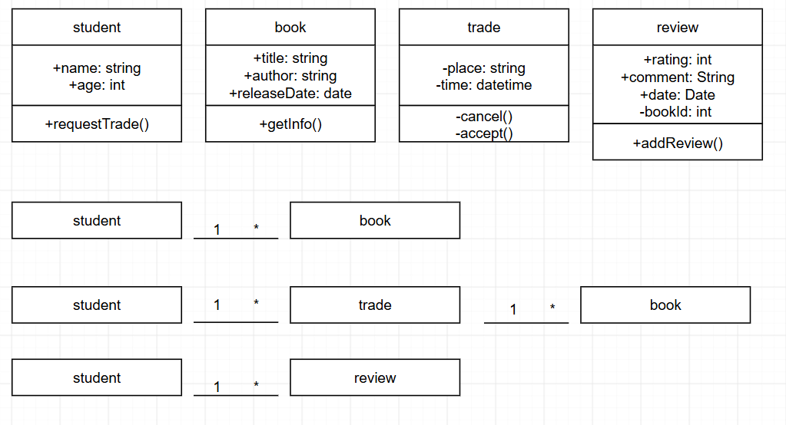
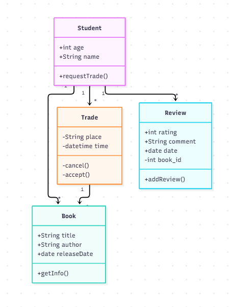
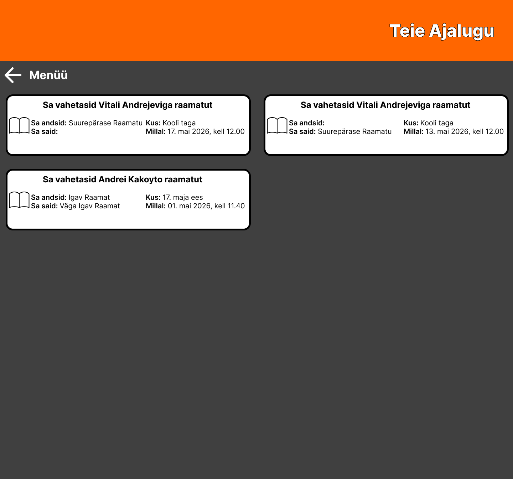
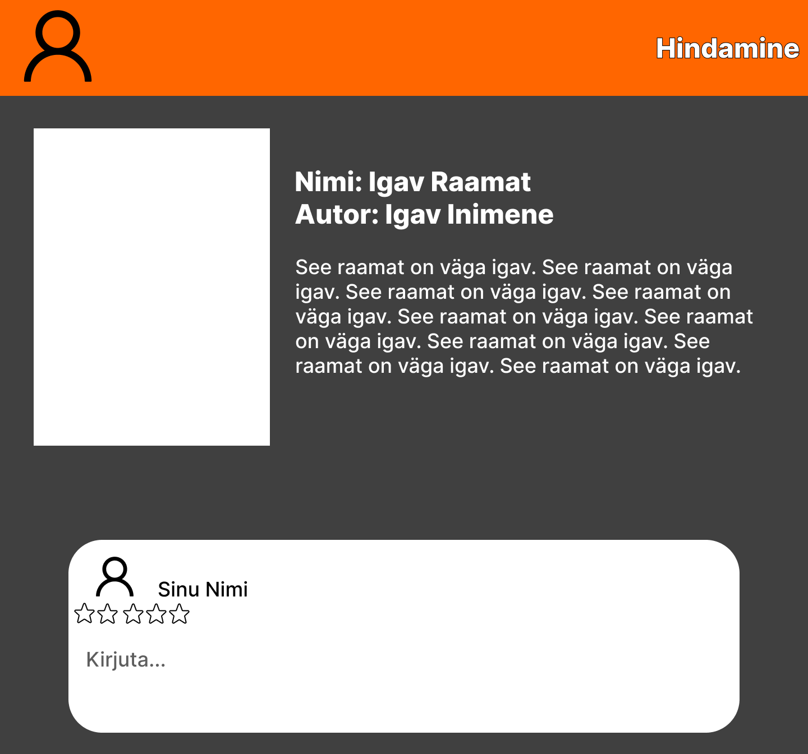

# Raamatuvahetus
Süsteem õpilastele raamatute vahetamiseks

**Autorid:** Ivan Sotnikov · NPTV24 Grupp

## Kasutajad ja nõuded
Kaks rolli: õpilane ja moderaator. Probleemide osas on kuus (8) kasutajalugu,
kõige olulisemad on märgitud kui „kohustuslikud“.

## Arendusmudel
Teeme seda järk-järgult, sest nii meile see ülesanne antigi. Meile anti üks ülesanne ja me täitsime selle. Kui olime selle lõpetanud, liikusime edasi järgmise juurde.

## Diagrammid
Statistika, statistika, lisamine, kirjutamine, vaata vahetuse ajalugu, sisu kinnitamine 

Üliõpilane, statistika, kaubandus, ülevaade 

 	classDiagram
  class Student {
    +int age
    +String name
    +requestTrade()
  }
    class Book {
    +String title
    +String author
    +date releaseDate
    +getInfo()
  }
    class Exchange {
    -String place
    -datetime time
    -cancel() 
    -accept()
  }
    class Review {
    +int rating
    +String comment
    +date date
    -int book_id
    +addReview()
  }
  Student "1" --> "*" Book
  Student "1" --> "*" Exchange
  Exchange "1" --> "*" Book
  Student "1" --> "*" Review

  VP
  1. Vaates polnud "paanide" paneeli 1[view](diagrammid/vp/view_ei_ole_panes.png)
  2. Ma ei tea, mis draw.io-s juhtuks.

## Vastused
1. Pärast klassi ümbernimetamist näitasid commitid reamuudatusi: vanad read punasega ja uued read rohelisega.

2. Kui oleksin PNG-faili asendanud, oleksid muudatused näidanud eemaldatud vana PNG-faili ja lisatud uut.

3. Nad peavad nimesid jälgima, et kõik ei oleks igal pool erinevalt nimetatud.

## Paigutus
Tegime seda inkrementaalselt, sest arvasin, et nii on mugavam töötada.)
 

## Kuidas me töötasime
Tahv alguses ja lõpus: `protsess/`. Kolmelauseline tagasivaade:
Enamik ülesandeid täideti probleemideta. Välja arvatud kuues ülesanne. See nõudis ühendamist ja pidi hõlmama meeskonnatööd, aga ma töötasin üksi.
